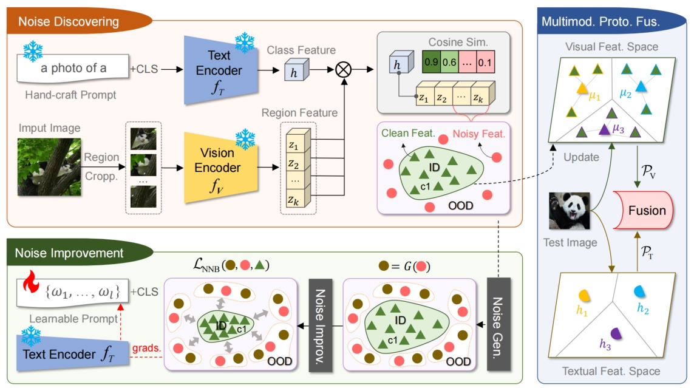
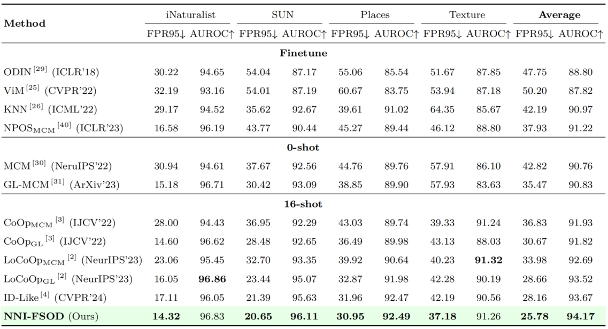

# 基于临界噪声增强的小样本分布外检测

### 摘要
对于部署在开放环境中的机器学习模型, 具备检测来自分布外 (Out-of-distribution, OOD) 数据的能力至关重要. 小样本分布外检测 (FSOD), 旨在从少量训练样本中快速学习辨识分布内 (In-distribution, ID) 样本和 OOD 数据的能力, 近年来受到了广泛关注. 先进的 FSOD 方法通过对预训练多模态大模型进行提示学习以快速挖掘判别性类别知识, 提升 OOD 检测水平. 尽管如此, 此类方法从“干净”训练样本中学得的模型在面对存在背景噪声的测试样本时鲁棒性较差, 容易将带有背景噪声的 ID 数据错误地识别为 OOD 数据, 反之亦然. 为了解决此问题, 本文提出一种基于临界噪声增强的小样本分布外检测方法 (NNI-FSOD). 在训练阶段, NNI-FSOD 借助多模态大模型强大的视觉-文本对齐能力, 将训练样本中的图片区域划分为干净区域和噪声区域, 并将噪声区域“变废为宝”用于紧致 ID 类别分布空间, 提升 OOD 检测水平. 在测试阶段, NNI-FSOD 促使视觉-文本类别原型知识“优势互补”, 以进一步提升 ID 分类和 OOD 检测性能. 在多个数据集上的实验结果证明了NNI-FSOD 的突出优势：平均而言, NNI-FSOD 将基线方法的 FPR95 提升了11.05%, AUROC 提升了2.24%, ID ACC 提升了1.87%, 最终超越先前最优方法取得最佳性能.

### 方法

在训练阶段, NNI-FSOD 将训练集中图片背景噪声“变废为宝”, 通过噪声发掘和噪声增强来提升模型的噪声鲁棒性与 OOD 检测性能. 在测试阶段, NNI-FSOD 通过多模态原型融合推
理, 促进视觉特征空间和文本特征空间中的类别原型“优势互补”, 进一步提升模型的 ID 分类和 OOD 检测水平.

### 数据集、预训练模型
本论文采用了和LoCoOp相同的实验数据集及预训练模型，请参考其代码库：[LoCoOp](https://github.com/AtsuMiyai/LoCoOp)

### 训练脚本
```train
CUDA_VISIBLE_DEVICES=0 bash scripts/train.sh data imagenet vit_b16_ep50 end 16
```

### 推理脚本 
```eval
CUDA_VISIBLE_DEVICES=0 bash scripts/eval.sh data imagenet vit_b16_ep50 1 output/imagenet/NNIFSOD/vit_b16_ep50_16shots/nctx16_cscFalse_ctpend/seed1
```

### 实验结果 

同先进算法的对比（w/ CLIP-B/16）

### 致谢
本代码库充分借鉴了LoCoOp的开源代码库：[LoCoOp](https://github.com/AtsuMiyai/LoCoOp)。由衷感谢该论文各位作者！
